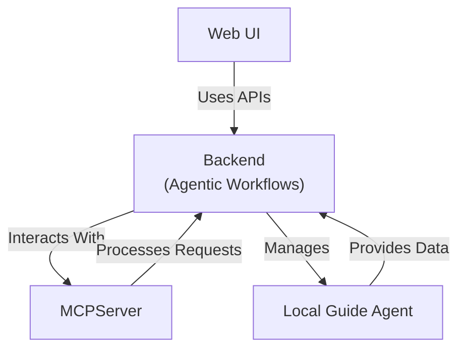

# Solution Architecture

This document provides a visual representation of the solution architecture for the Accede Travel Concierge application. The diagram below illustrates the main components.

