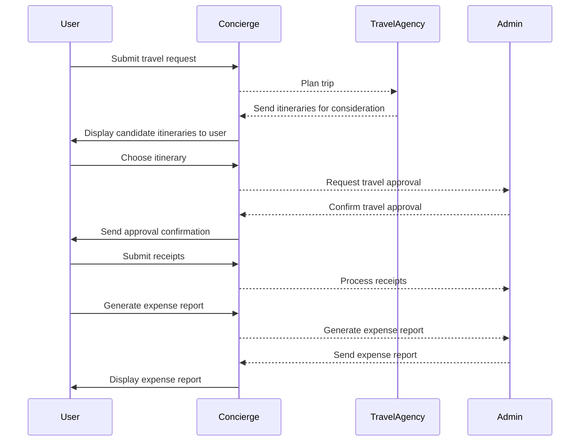

# Accede Travel Agency

This is a multi-agent sample using Microsoft.Extensions.AI and Semantic Kernel Agents Framework

## Key Components

### Models/
Defines core data structures like `ApprovalRequest`, which encapsulates details of business approval workflows, including request types and statuses.

### ProcessSteps/
Implements workflow logic, such as `ApprovalStep`, which handles trip approval processes and integrates with event-driven systems.

### MyProxyClient.cs
Facilitates external interactions by processing events like `AdminApprovalNeeded` and `TravelBooked`.

### ServiceExtensions.cs
Configures the travel planning workflow, registering steps and defining event-driven transitions.

### Program.cs
The entry point that initializes dependencies, orchestrates workflows, and demonstrates service capabilities with sample data.
## Workflow

